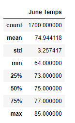
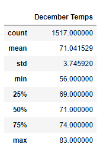

# Surfs Up 
## An Analysis with Advanced Data Storage and Retrieval

### Project Overview
An investor is interested in investing in your idea of building a surf and ice cream shop in Oahu, Hawaii. The investor however would like to have an analysis of how the weather is in that area and if the shop would be forced to close at given times of the year due to inclimate weather. The investor has requested temperature data for the months of June and December in Oahu, in order to determine if the surf and ice cream shop business is sustainable year-round.

### Results
#### Summary Statistics for June

* The mean temperature for June is roughly 75 degrees, with a max temperature of 85 degrees.

#### Summary Statistics for December

* The mean temperature for December is roughly 71 degrees, with a max temperature of 83 degrees.

* The mean temperatures in June and December are relatively close in temperature. Just looking at the temperatures, it seems like the surf and ice cream shop would be a good investment given the mild temperatures in those months.

### Summary
Additional queries could be analyzed to give a better picture if the surf and ice ceam shop is a good investment. For example, the precipitation in these months would give a more complete picture of the overall weather in those months. In June and December, rain and snow are a possibility and therefore the store could be rained out and have little to no business that day. It also may be beneficial to pull another month's data, such as April, to show how the weather is in the Spring, April is generally the month that sees a lot of precipitation as well.
